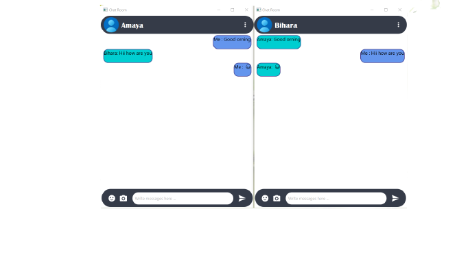

# *About*
This is my Network Programming Project of **Live Chat Application**.

# *Introduction*
Play Tech Pvt Ltd. is a company that supplies various types of gaming equipment. This company has a customer support division that assists customers regarding the Play Tech equipment.

To give efficient customer support by company decide to make  designing a Customized Chat for the employees of Play Tech Pvt Ltd.

This chat room to be exclusive to the employees of the Play Tech customer service division, where they can chat freely as a group and express themselves using emojis or images.

# *Role*
This chat room is supposed to be used by employees of the customer service division of Play Tech Pvt Ltd. who will be referred to as users later on.

# *System Requirements*
* Users can log into the chat room using his/her name.
* A user can send a message.
* The chat should update with every message sent simultaneously with all the users.
* The messages can contain text, Unicode characters, emojis, and images.
* The chat interface can be minimized until it is needed to avoid disturbancesto the work of the 
  users.

# *Details*

Below you can see the languages,tools I used and function of the project.

## Languages

#### Java 
* JavaFX 
* Socket Programming 

## Tools
* Intellij IDE

